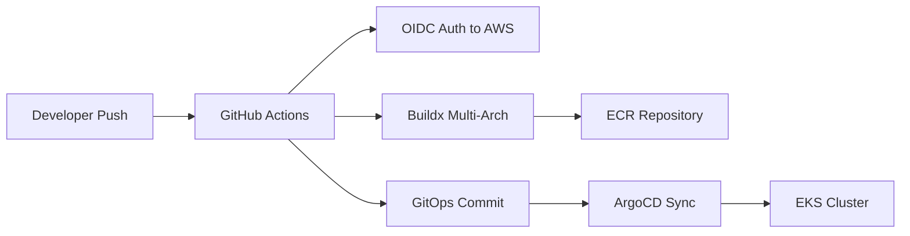

# My DevOps Project

Infrastructure-as-Code, CI/CD pipelines, and Kubernetes deployment for the voting-app microservices stack.

## Architecture Overview

```
                    my-devops-project (this repo)
                    ├── .github/workflows/
                    │   ├── ci-local.yml               # Local Kind CI
                    │   ├── ci-kind-test.yml            # Kind integration tests
                    │   └── deploy-voting-app.yml       # Central CD (monorepo-style)
                    ├── infra-aws/                      # Terraform (VPC, EKS, OIDC, ECR)
                    ├── charts/
                    │   ├── argocd-apps/                # ArgoCD App-of-Apps (Helm)
                    │   ├── gateway-config/             # Gateway API + HTTPRoutes
                    │   └── infra-bootstrap/            # ESO, SecretStore
                    ├── k8s/                            # ExternalSecret manifests
                    ├── keycloak/                       # Keycloak Helm chart (OIDC provider)
                    ├── voting-app-vote/                # Vote service (Python/Flask)
                    ├── voting-app-result/              # Result service (Node.js)
                    └── voting-app-worker/              # Worker service (.NET)
```

## CI/CD Flow



- **OIDC**: No static AWS keys — temporary credentials via GitHub OIDC token
- **Multi-arch**: Docker images built for both `linux/amd64` and `linux/arm64`
- **GitOps**: CI updates image tags in a GitOps repo, ArgoCD auto-syncs to EKS
- **Monorepo CI**: All builds visible in this repo's Actions tab

## Components

| Directory | Purpose | Tech Stack |
|-----------|---------|------------|
| `infra-aws/` | AWS infrastructure | Terraform (VPC, EKS, ECR, IAM, Secrets Manager) |
| `charts/argocd-apps/` | ArgoCD App-of-Apps | Helm (GitOps bootstrapper) |
| `charts/gateway-config/` | Gateway API + HTTPRoutes | Helm, Gateway API |
| `charts/infra-bootstrap/` | ESO, SecretStore | Helm |
| `k8s/` | ExternalSecret manifests | Kubernetes manifests |
| `keycloak/` | SSO / OIDC provider | Keycloak Helm chart |
| `voting-app-*/` | Microservice source code | Python / Node.js / .NET |

## Prerequisites

- AWS account with CLI configured
- Terraform >= 1.5
- kubectl, kind (for local dev)
- GitHub CLI (`gh`)

## Quick Start

```bash
# 1. Deploy infrastructure
cd infra-aws
terraform init && terraform apply

# 2. Get CI role ARN
terraform output github_ci_role_arn

# 3. Push code to trigger CI
git push origin main
# Then go to: https://github.com/mochthebest-byte/my-devops-project/actions

# Or trigger manually:
gh workflow run deploy-voting-app.yml -f service=all -f environment=dev
```
