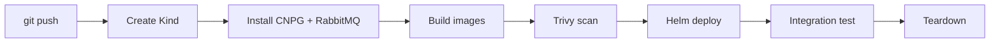
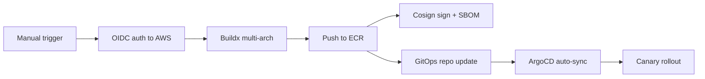

# Project Conclusions — my-devops-project

> **Date:** 2026-07-02
> **Author:** mochthebest-byte / Claude Code  
> **Repository:** [mochthebest-byte/my-devops-project](https://github.com/mochthebest-byte/my-devops-project)

---

## 1. Project Overview

**my-devops-project** is a complete DevOps infrastructure for a **voting application** consisting of three microservices (vote, result, worker). The project manages the full lifecycle:

- **Infrastructure as Code** — AWS resources via Terraform
- **Kubernetes deployment** — Helm charts for all services, deployed via ArgoCD
- **CI/CD** — GitHub Actions for building, scanning, signing, and deploying container images
- **Local development** — Kind cluster + Makefile for zero-AWS-dependency testing
- **Disaster Recovery** — documented procedure for full AWS account migration

---

## 2. Detailed Project Description

### 2.1 Project Genesis and Purpose

This project was created as a **hands-on DevOps learning platform** — a real, working cloud-native application that exercises the full spectrum of modern DevOps practices. It is not a toy or a demo; it is a production-grade system deployed on AWS EKS with real TLS, SSO, monitoring, secrets management, and CI/CD.

The application itself is a **voting system** (inspired by the classic Docker voting-app example), but the infrastructure built around it — Terraform, Kubernetes, Helm, ArgoCD, Vault, GitHub Actions, CloudNativePG, Karpenter, Envoy Gateway, Keycloak, Grafana/Loki/Tempo — is what makes this project significant.

### 2.2 Vote Data Flow

```
User Browser
    │
    ▼
┌─────────────────────────────────────────────────────────────┐
│  vote (Python/Flask)                                        │
│  ● Serves HTML voting UI at vote.mochthebest.pp.ua          │
│  ● On POST: publishes vote to RabbitMQ stream queue         │
│  ● Reads POSTGRES_HOST/POSTGRES_DB from env (CNPG dynamic)  │
└───────────────────────┬─────────────────────────────────────┘
                        │ RabbitMQ: stream queue "votes"
                        ▼
┌─────────────────────────────────────────────────────────────┐
│  worker (C# .NET 8)                                         │
│  ● Reads from RabbitMQ stream queue (x-stream-offset: last) │
│  ● Creates table "votes" if not exists                      │
│  ● INSERTs vote (id, vote), UPDATEs on conflict             │
│  ● Uses Npgsql 4.1.9 with Trust Server Certificate          │
│  ● Acknowledges (acks) message after successful write       │
└───────────────────────┬─────────────────────────────────────┘
                        │ PostgreSQL (CNPG pg-vote)
                        ▼
┌─────────────────────────────────────────────────────────────┐
│  result (Node.js/Express)                                   │
│  ● Reads from PostgreSQL (pooled connections)                │
│  ● Serves live results page via WebSocket                   │
│  ● Polls DB every second for new votes                      │
│  ● AngularJS frontend renders animated bar chart            │
└─────────────────────────────────────────────────────────────┘
```

### 2.3 Service Details

#### Vote Service (Python/Flask)

| Attribute | Detail |
|-----------|--------|
| **Language** | Python 3.11 (Flask) |
| **Port** | 80 (container) → 8080 (targetPort) → 5000 (service) |
| **DB** | PostgreSQL via Npgsql-wrapped env vars |
| **Queue** | RabbitMQ (stream queue) — publishes votes as JSON |
| **Health** | `/healthz` endpoint (Gunicorn WSGI) |
| **Security** | Init containers: `wait-for-postgresql`, `wait-for-rabbitmq` |
| **Scaling** | 2 replicas (production), 1 replica (local/CI) |
| **Secrets** | Dynamic credentials via `pg-vote-dynamic` VSO secret |

#### Result Service (Node.js/Express)

| Attribute | Detail |
|-----------|--------|
| **Language** | Node.js 20 (Express) |
| **Port** | 80 (container) → 8080 (targetPort) → 81 (service) |
| **DB** | PostgreSQL via `pg` library with connection pool |
| **Frontend** | AngularJS with animated bar chart |
| **WebSocket** | Not used — polls DB every 1 second |
| **Secrets** | Same dynamic credentials as vote and worker |

#### Worker Service (C# .NET 8)

| Attribute | Detail |
|-----------|--------|
| **Language** | C# .NET 8 |
| **Framework** | Npgsql 4.1.9 + RabbitMQ.Client 6.8.1 + Newtonsoft.Json 13.0.1 |
| **DB** | PostgreSQL — creates table `votes(id VARCHAR(255) UNIQUE, vote VARCHAR(255))` |
| **Queue** | RabbitMQ stream consumer (`x-stream-offset: last`) |
| **Flow** | `OpenDbConnection` → `QueueDeclare` → `BasicConsume` → `UpdateVote` |
| **Error handling** | Catches `SocketException`/`DbException` in retry loop; nacks on processing failure |

### 2.4 Technology Stack

| Layer | Technology |
|-------|-----------|
| **Cloud** | AWS (eu-central-1 / Frankfurt) |
| **IaC** | Terraform (state in S3 + DynamoDB) |
| **Kubernetes** | EKS 1.31 (managed by Terraform) |
| **Autoscaling** | Karpenter (NodePool + EC2NodeClass) |
| **PostgreSQL** | CloudNativePG 1.30 (PostgreSQL 18, 2 instances, WAL archiving to S3) |
| **Message broker** | RabbitMQ 4.x (stream queues, RabbitMQ Cluster Operator) |
| **Secrets management** | HashiCorp Vault + Vault Secrets Operator (dynamic DB creds) |
| **SSO/OIDC** | Keycloak (Grafana auth) |
| **Gateway/Ingress** | Envoy Gateway (Kubernetes Gateway API v1) |
| **DNS** | Route53 (auto-provisioned via external-dns) |
| **TLS** | ACM wildcard cert + cert-manager for internal certs |
| **Monitoring** | Grafana + Loki (logs) + Tempo (traces) |
| **Security** | Kyverno policies, Trivy scanner, Cosign image signing |
| **GitOps** | ArgoCD (App-of-Apps pattern, self-heal) |
| **CI/CD** | GitHub Actions (OIDC auth, multi-arch buildx, SBOM generation) |
| **Backups** | Velero (S3, CNPG WAL archiving to S3) |
| **Budget** | AWS Budget ($50/month with 80%/100% alerts) |

### 2.5 Repository Structure

```
my-devops-project/
│
├── .github/workflows/          # CI/CD pipelines
│   ├── ci-kind-test.yml        # Kind integration test (push)
│   ├── ci-local.yml            # Local Kind test (manual)
│   └── deploy-voting-app.yml   # Build → ECR → GitOps (production)
│
├── infra-aws/                  # Terraform — full AWS infra
│   ├── main.tf, vpc.tf, eks.tf, ecr.tf, dns.tf
│   ├── addons.tf, karpenter.tf, velero.tf, budget.tf
│   ├── github-oidc.tf, secrets.tf, outputs.tf
│   ├── backend.hcl             # S3 backend config
│   └── terraform.tfvars        # Variables (domain, region)
│
├── charts/                     # Infrastructure Helm charts
│   ├── argocd-apps/            # ArgoCD App-of-Apps (18 applications)
│   ├── gateway-config/         # Envoy Gateway + HTTPRoutes
│   ├── cnpg-clusters/          # CloudNativePG cluster definitions
│   ├── vault-init/             # Vault bootstrap one-shot Job
│   ├── vso-config/             # Vault Secrets Operator CRDs
│   ├── karpenter-chart/        # Karpenter controller
│   ├── karpenter-resources/    # NodePool, EC2NodeClass
│   ├── rabbitmq/               # RabbitMQ cluster definition
│   ├── rabbitmq-operator/      # RabbitMQ Cluster Operator
│   ├── keycloak/               # SSO/OIDC provider
│   ├── loki-tempo/             # Logging + tracing stack
│   ├── infra-bootstrap/        # Namespaces, RBAC
│   ├── cert-manager-issuers/   # Let's Encrypt issuers
│   ├── kyverno-policies/       # Pod security policies
│   ├── grafana-datasources/    # Loki/Tempo datasources
│   ├── root-app/               # Root ArgoCD Application
│   └── argo-rollout-vote/      # Canary deployment
│
├── voting-app-vote/            # Vote microservice
│   ├── app.py                  # Python/Flask application
│   ├── wsgi.py                 # Gunicorn WSGI entrypoint
│   ├── Dockerfile              # Multi-arch build
│   ├── requirements.txt
│   └── charts/vote/            # Vote Helm chart
│       ├── templates/
│       │   ├── deployment.yaml     # Rollout + Deployment
│       │   ├── service.yaml
│       │   ├── rollout.yaml        # Argo Rollout (canary)
│       │   └── ...
│       └── values.yaml
│
├── voting-app-result/          # Result microservice
│   ├── server.js               # Node.js/Express + AngularJS
│   ├── Dockerfile
│   ├── package.json
│   ├── views/                  # Frontend templates
│   ├── tests/                  # CI test scripts
│   └── charts/result/
│       └── templates/
│           ├── deployment.yaml
│           └── service.yaml
│
├── voting-app-worker/          # Worker microservice
│   ├── Program.cs              # C# .NET background consumer
│   ├── Worker.csproj
│   ├── Dockerfile
│   └── charts/worker/
│       └── templates/
│           └── deployment.yaml
│
├── k8s/local/                  # Local Kind development
│   ├── SETUP.md                # Step-by-step local setup
│   ├── kind-config.yaml        # Kind cluster config
│   └── values-local.yaml       # Local Helm overrides
│
├── scripts/                    # Utility scripts
│   ├── bootstrap-backend.sh    # Terraform S3 + DynamoDB bootstrap
│   ├── enable-aws.sh           # Enable AWS Terraform
│   ├── disable-aws.sh          # Disable AWS Terraform (local dev)
│   └── tunnel-*.sh             # Port tunneling scripts
│
├── docs/                       # Documentation
│   └── disaster-recovery-aws-migration.md
│
├── monitoring-values.yaml      # Grafana OIDC + deployment config
└── root-app.yaml               # ArgoCD root Application manifest
```

### 2.6 GitOps and Deployment Model

```
                    ┌─────────────────────┐
                    │  my-devops-project   │  ← Git (single source of truth)
                    │  (this repository)   │
                    └──────┬──────────┬───┘
                           │          │
              ┌────────────┘          └────────────┐
              ▼                                     ▼
    ┌──────────────────┐               ┌──────────────────────┐
    │  GitHub Actions   │               │  ArgoCD              │
    │  (CI/CD)          │               │  (GitOps)            │
    │                   │               │                      │
    │  ● CI: push →     │               │  ● Watches main      │
    │    Kind test       │               │  ● Syncs every 3 min │
    │  ● CD: manual →    │               │  ● Self-heals drift  │
    │    ECR push        │               │  ● 18 applications   │
    └──────────────────┘               └──────────┬───────────┘
                                                   │
                                                   ▼
                                        ┌──────────────────┐
                                        │  EKS Cluster      │
                                        │  ──────────────── │
                                        │  ● vote, result,  │
                                        │    worker          │
                                        │  ● CNPG, RabbitMQ  │
                                        │  ● Vault + VSO     │
                                        │  ● Keycloak        │
                                        │  ● Grafana/Loki    │
                                        │  ● Karpenter       │
                                        └──────────────────┘
```

The ArgoCD **App-of-Apps** pattern works as follows:

1. **root-app.yaml** creates a single ArgoCD Application named `root-app`
2. `root-app` syncs `charts/argocd-apps/` which contains **18 ArgoCD Application templates**
3. Each template defines a child Application pointing to a specific chart path
4. Applications are ordered via `sync-wave` annotations:
   - **Wave 0:** `karpenter` (provisioner before workloads)
   - **Wave 1:** `infra-bootstrap` (namespaces + RBAC)
   - **Wave 2:** `cnpg-clusters`, `rabbitmq`, `vault-init`, `cert-manager-issuers`
   - **Wave 3:** `voting-app`, `worker`, `result`, `gateway-config`, `keycloak`

### 2.7 Secrets Architecture

```
AWS Secrets Manager (static secrets)
    │
    ▼
External Secrets Operator
    │
    ▼
Kubernetes Secret "postgresql" (CNPG superuser password)
    │
    ▼
CloudNativePG Cluster "pg-vote"
    │  ├── Auto-generates Secret "pg-vote-app" (user: app)
    │  └── Auto-generates Service "pg-vote-rw" (read-write endpoint)
    │
    ▼
Vault (database/creds/voting-app-dynamic)
    │  ├── vault-init Job configures DB engine
    │  ├── Reads pg-vote-app for initial DB connection
    │  └── Creates dynamic PostgreSQL users (TTL 1h, max 24h)
    │
    ▼
Vault Secrets Operator (VSO)
    │  ├── VaultDynamicSecret "pg-vote-dynamic"
    │  ├── Auto-refreshes credentials before TTL expiry
    │  └── Writes to Kubernetes Secret "pg-vote-dynamic"
    │
    ▼
pods (vote, result, worker)
       └── envFrom: secretRef "pg-vote-dynamic"
```

### 2.8 Observability Stack

| Component | Tool | Storage |
|-----------|------|---------|
| **Metrics** | Prometheus (kube-prometheus-stack) | In-cluster (PersistentVolume) |
| **Logs** | Loki | S3-backed (`voting-app-velero-backups-<ID>/loki/`) |
| **Traces** | Tempo | S3-backed (same bucket) |
| **Dashboards** | Grafana | ConfigMaps (auto-provisioned) |
| **Auth** | Keycloak OIDC (Grafana SSO) | — |

Grafana is accessible at `https://grafana.mochthebest.pp.ua` with Keycloak SSO authentication.

### 2.9 Development Workflow

#### Local Development (Zero AWS)

```bash
make cluster    # Create Kind cluster (3 nodes)
make deploy     # Build images + deploy all charts
make test       # Run integration tests
make teardown   # Delete everything
```

The local setup (`k8s/local/`) uses:
- **Kind** with ingress-nginx instead of ALB
- **No Vault** — uses static CNPG secret directly
- **No Karpenter** — static worker nodes
- **No ArgoCD** — Helm CLI deploys directly
- **No AWS** — all resources in-cluster

#### CI Pipeline (GitHub Actions)



#### Production Deployment



### 2.10 Security Features

- **No static AWS keys** — GitHub OIDC provides temporary credentials
- **Dynamic DB credentials** — Vault generates ephemeral PostgreSQL users (TTL 1h)
- **Container security** — Trivy scans for CRITICAL+HIGH vulnerabilities (blocks push)
- **Image signing** — Cosign signs images + attaches SBOM attestations
- **Pod security** — Kyverno enforces `runAsNonRoot`, capabilities drop, seccomp
- **Network policies** — micro-segmentation between services
- **TLS everywhere** — ACM wildcard cert for public endpoints, self-signed for internal
- **Multi-arch scanning** — images built and scanned for both amd64 and arm64

---

## 3. Architecture

### 3.1 Services

| Service | Language | Description | DB |
|---------|----------|-------------|-----|
| **vote** | Python (Flask) | Frontend web UI for casting votes | PostgreSQL (via RabbitMQ → worker) |
| **result** | Node.js (Express) | Live results display (WebSocket) | PostgreSQL (read-only) |
| **worker** | C# (.NET 8) | Background consumer — reads from RabbitMQ, writes to PostgreSQL | PostgreSQL (write) |

### 3.2 Infrastructure Stack (AWS)

```
AWS Account (657954628960, eu-central-1)
├── VPC (public + private subnets, NAT Gateway, Internet Gateway)
├── EKS Cluster (Karpenter autoscaling)
├── ECR Repositories (my-app/vote, my-app/result, my-app/worker)
├── RDS via CloudNativePG (in-cluster PostgreSQL)
├── Route53 Zone (mochthebest.pp.ua)
├── ACM Certificate (wildcard *.mochthebest.pp.ua)
├── S3 Buckets (Terraform state, Velero backups, ALB logs)
├── IAM Roles (GitHub OIDC, Karpenter, Velero, Cluster Autoscaler, etc.)
├── AWS Budget ($50/month with email alerts)
└── ALB + Gateway API (Envoy Gateway)
```

### 3.3 In-Cluster Services (18 ArgoCD Applications)

```
WAVE 0 — Infrastructure:
├── karpenter                  — Karpenter provisioner

WAVE 1 — Bootstrap:
├── infra-bootstrap            — Namespaces, RBAC, priority classes

WAVE 2 — Data Layer:
├── cnpg-clusters              — CloudNativePG PostgreSQL clusters
├── rabbitmq                   — RabbitMQ message broker
├── rabbitmq-operator          — RabbitMQ Cluster Operator
├── cert-manager-issuers       — Let's Encrypt ClusterIssuers
├── vault-init                 — Vault bootstrap (one-shot Job)
├── vso-config                 — Vault Secrets Operator infrastructure
├── vault-vote-secrets         — VSO config for dynamic DB creds

WAVE 3 — Applications:
├── voting-app                 — Vote frontend
├── worker                     — Background worker
├── result                     — Result service
├── argo-rollout-vote          — Canary deployment for vote
├── gateway-config             — Envoy Gateway config + routes
├── keycloak                   — SSO/OIDC provider
├── loki-tempo                 — Logging (Loki) + Tracing (Tempo)
├── karpenter-resources        — NodePool, EC2NodeClass
├── kyverno-policies           — Pod security policies
```

### 3.4 Secrets Flow

```
CNPG Cluster → Secret "pg-vote-app" (static app user)
  → vault-init Job reads pg-vote-app, configures Vault DB engine
    → VSO VaultDynamicSecret "pg-vote-dynamic" (ephemeral, TTL 1h)
      → pods use pg-vote-dynamic for DB credentials
```

---

## 4. Infrastructure Highlights

### 4.1 Terraform (`infra-aws/`)

- **~200 resources** created on `terraform apply`
- State managed via S3 (`voting-app-tfstate-<ACCOUNT_ID>`) + DynamoDB locking
- Key modules: VPC, EKS, ECR, Route53, ACM, IAM, S3, Karpenter, Velero
- EKS addons: `aws-ebs-csi-driver` (v1.61.1), `coredns`, `kube-proxy`, `vpc-cni`

### 4.2 CloudNativePG (CNPG)

- Two PostgreSQL clusters: `pg-vote` (voting-app) and `pg-keycloak` (keycloak)
- PostgreSQL 18 with automatic failover and backups
- WAL archiving to S3 via barman-cloud (IAM role: `voting-app-cnpg-backup`)
- SSL enabled by default with self-signed certificates
- Auto-generates secret `<cluster>-app` with keys: `username`, `password`, `dbname`, `host`, `port`, `uri`

### 4.3 Key Differences from Legacy Bitnami PostgreSQL

| Feature | Bitnami (old) | CNPG (new) |
|---------|--------------|------------|
| SSL | Off by default | On (self-signed cert) |
| Password auth | md5 | scram-sha-256 |
| Auto-generated secret | `postgresql` | `<cluster>-app` |
| Database name | `app` (configurable) | `db` (from values) |
| HA | Manual | Automatic (streaming replica) |

---

## 5. CI/CD Pipelines

### 5.1 Workflows

| Workflow | Trigger | Environment | Duration |
|----------|---------|-------------|----------|
| `ci-kind-test.yml` | Push (any branch) | Kind cluster (GitHub Actions) | ~8-10 min |
| `ci-local.yml` | Manual | Kind cluster (local) | ~5 min |
| `deploy-voting-app.yml` | Manual / webhook | EKS (production) | ~10 min |

### 5.2 CI Pipeline Steps (ci-kind-test.yml)

1. **Create Kind cluster** — 3 nodes (1 control-plane, 2 workers) via `helm/kind-action`
2. **Install ingress-nginx** — for HTTP routing
3. **Add Helm repos** — `cnpg`, `rabbitmq`, `bitnami`
4. **Create namespaces** — `voting-app`, `cnpg-system`, etc.
5. **Install CloudNativePG operator** — latest release
6. **Create CNPG cluster** — `pg-ci`, 1 instance, database `db`, user `app`
7. **Install RabbitMQ Cluster Operator + cluster** — Operator first, then wait for pods
8. **Wait for DBs** — both CNPG and RabbitMQ must be Ready
9. **Build Docker images** — `vote:latest`, `result:latest`, `worker:latest` from local source
10. **Trivy vulnerability scan** — fail on CRITICAL+HIGH
11. **Deploy via Helm** — with CI-specific overrides
12. **Wait for deployments** — `kubectl rollout status deployment/vote --timeout=120s`
13. **Create Ingress** — for host-based routing
14. **Integration test** — port-forward → POST vote → check DB → verify result

### 5.3 CI Overrides (for Kind — no AWS dependencies)

```
--set scaledObject.create=false         # no KEDA CRD in Kind
--set pdb.create=false                   # no PodDisruptionBudget
--set networkPolicy.create=false         # no NetworkPolicy (CNI)
--set canary.enabled=false               # no Argo Rollouts CRD
--set postgresql.host=pg-ci-rw           # CNPG cluster in Kind
--set postgresql.database=db             # match CNPG initdb
--set postgresql.existingSecret=pg-ci-app  # CNPG auto-generated secret
```

### 5.4 Production CD Pipeline (deploy-voting-app.yml)

1. **Resolve service matrix** — "all" → ["vote", "result", "worker"]
2. **Checkout repos** — Dockerfiles from this repo, app source from `mochthebest-byte/voting-app`
3. **OIDC auth to AWS** — `aws-actions/configure-aws-credentials@v4` with `vars.AWS_ACCOUNT_ID`
4. **Login to ECR** — `amazon-ecr-login@v2`
5. **Build multi-arch** — linux/amd64 + linux/arm64 with Docker Buildx
6. **Trivy scan** — fail build on CRITICAL+HIGH (CVE fix)
7. **Generate SBOM** — CycloneDX format, uploaded as artifact
8. **Push to ECR** — tagged with commit SHA + `latest`
9. **Cosign sign** — keyless signing via GitHub OIDC
10. **Cosign attest** — attach SBOM as attestation
11. **GitOps update** — optional: update `image.tag` in separate GitOps repo

---

## 6. Local Development

### 6.1 Prerequisites

- Docker + Kind
- `kubectl`, `helm`, `make`
- No AWS account needed

### 6.2 Quick Start

```bash
# From k8s/local/
make cluster     # 5-10 seconds
make deploy      # 2-3 minutes
# Add to /etc/hosts:
echo "127.0.0.1 vote.local result.local" | sudo tee -a /etc/hosts
# Open: http://vote.local
```

### 6.3 Architecture (Local vs Production)

| Component | Local (Kind) | Production (EKS) |
|-----------|-------------|------------------|
| **PostgreSQL** | Bitnami Helm chart | CloudNativePG (2 instances) |
| **RabbitMQ** | Bitnami Helm chart | RabbitMQ Operator + cluster |
| **Vault** | No | Yes (VSO + vault-init) |
| **Ingress** | ingress-nginx (NodePort) | Envoy Gateway (ALB) |
| **DNS** | `/etc/hosts` | Route53 + external-dns |
| **TLS** | No | ACM + cert-manager |
| **Auth** | No | Keycloak OIDC |
| **Secrets** | Hardcoded in values | Vault + VSO dynamic |

---

## 7. Key Fixes Made (Session 2026-07-01)

### 7.1 Database Name Mismatch

**Problem:** CNPG creates database `db`, but all apps configured with `database: app`.

**Fix:** Changed `database: app → db` in all 4 charts (vote, result, worker, argo-rollout-vote) + CI overrides.

**Files:** `voting-app-*/charts/*/values.yaml`, `charts/argo-rollout-vote/values.yaml`, `.github/workflows/ci-*.yml`

### 7.2 SSL Certificate (Npgsql 4.1.9 + CNPG)

**Problem:** CNPG SSL enabled with self-signed cert. Npgsql 4.1.9 rejects self-signed certs.

**Fix:** Added `Trust Server Certificate=true` to connection string in `Program.cs`.

**Files:** `voting-app-worker/Program.cs`

### 7.3 Vault Dynamic User Permissions

**Problem:** Vault dynamic user had INSERT/SELECT/UPDATE/DELETE on tables but not `CREATE ON SCHEMA public`. Worker's `CREATE TABLE IF NOT EXISTS votes` failed with `permission denied for schema public`.

**Fix:** Added `GRANT USAGE, CREATE ON SCHEMA public TO "{{name}}"` to Vault database role creation statements.

**Files:** `charts/vault-init/templates/job.yaml`

### 7.4 CI psql Authentication

**Problem:** CI test script used `psql -U app -d db` without `-h`. `psql` connects via Unix socket → peer auth → OS user `postgres` doesn't match DB user `app` → silent failure (suppressed by `2>/dev/null`).

**Fix:** Added `-h localhost` to force TCP connection with scram-sha-256 password auth.

**Files:** `.github/workflows/ci-kind-test.yml`, `.github/workflows/ci-local.yml`

### 7.5 Non-Exists: KEDA, Argo Rollouts, VSO in Kind

**Problem:** Kind cluster doesn't have CRDs for KEDA, Argo Rollouts, Vault Secrets Operator. Helm charts fail to render these resources.

**Fix:** Added `--set` overrides to disable CRD-dependent resources.

**Files:** `.github/workflows/ci-*.yml`

### 7.6 Image Digest Alignment

**Problem:** Worker `values.yaml` had hardcoded image digest pointing to old image without SSL fix.

**Fix:** Rebuilt worker image with SSL fix, updated digest in values.yaml, pushed to ECR with `latest` tag.

**Files:** `voting-app-worker/charts/worker/values.yaml`

---

## 8. Lessons Learned

### 8.1 Npgsql + SSL

- **Npgsql 4.x** validates server SSL certificate by default
- **CNPG** enables SSL with self-signed certs
- **Fix:** Add `Trust Server Certificate=true;` to Npgsql connection string
- Consider upgrading Npgsql (4.1.9 has known high-severity vulnerabilities per NuGet warnings)

### 8.2 CNPG Authentication

- CNPG uses `scram-sha-256` for host connections, `peer` for local socket
- `local all all peer map=local` in pg_hba.conf — peer auth means OS user must match DB user
- For `kubectl exec` queries, always use `-h localhost` or `-h <service>` to force TCP

### 8.3 Vault Dynamic Secrets

- Vault dynamic credentials have TTL (default 1h)
- VSO rotates credentials silently — running pods don't update env vars
- Dynamic users inherit from `vault` role — grants to `vault` role apply to all dynamic users
- Need both `USAGE ON SCHEMA` (access) and `CREATE ON SCHEMA` (DDL) in addition to DML grants

### 8.4 ArgoCD Self-Healing

- ArgoCD reverts manual `kubectl set image` changes within seconds
- To deploy a fix quickly: update values.yaml digest, commit, push, let ArgoCD sync
- Alternatively: disable `spec.syncPolicy.automated.selfHeal` temporarily

### 8.5 CI Pipeline Debugging

- `2>/dev/null` in CI scripts hides failures — remove it for debugging
- GitHub Actions logs don't show stderr from suppressed commands
- Always match CI environment resources (pod names, secret names, database names) between test script and setup steps

### 8.6 CNPG vs Bitnami PostgreSQL Migration

- Bitnami defaults differ from CNPG: SSL, auth method, database name, secret name
- Database migration from Bitnami to CNPG requires verifying each of these differences
- Vault DB engine connection must be reconfigured after migration (new host, new credentials)

---

## 9. Recommendations

### 9.1 Short-term

1. **Upgrade Npgsql** from 4.1.9 to 8.x — fixes vulnerability GHSA-x9vc-6hfv-hg8c and improves SSL/scram-sha-256 support
2. **Розгорнути Redis** — vote app в production потребує Redis (див. [розділ 10.4](#104-in-cluster-caching-redis))
3. **Add `workflow_dispatch`** trigger to CI workflows for manual re-runs without dummy commits
4. **Fix Velero S3 backup** — CNPG WAL archiving failing with `AccessDenied` on `sts:AssumeRoleWithWebIdentity`

### 9.2 Medium-term

1. **Unify vote app code** — reconcile differences between `voting-app-vote/app.py` (RabbitMQ-based) and production image (Redis-based). The production image built from `mochthebest-byte/voting-app` repo has different architecture.
2. **Add Vault cluster monitoring** — Vault credentials expiring cause pod failures; add alerts and dashboard
3. **CI caching** — додати GitHub Actions Cache для Docker шарів, NuGet, pip, npm (див. [розділ 10.2-10.3](#102-docker-layer-caching))
4. **Upgrade Node.js 20 actions** — GitHub Actions deprecating Node.js 20 in favor of Node.js 24

### 9.3 Long-term

1. **Disaster recovery automation** — script the full AWS migration procedure from `docs/disaster-recovery-aws-migration.md`
2. **GitOps for image updates** — use ArgoCD Image Updater to automatically update image digests based on ECR changes
3. **Multi-region** — extend Terraform for failover to another region
4. **HPA based on RabbitMQ queue depth** — use KEDA `ScaledObject` with RabbitMQ trigger for the worker

---

## 10. Аналіз кешування (Caching)

### 10.1 Стан кешування в проекті

| Тип кешу | Поточний стан | Вплив |
|----------|--------------|-------|
| **Docker шари** (CI local) | `ci-kind-test.yml` — `docker build` без кешу | CI збирає з нуля кожен раз, ~1-2 хв на сервіс |
| **Docker шари** (CD prod) | `--cache-from type=registry,ref=...:latest` + `--cache-to type=inline` | Працює добре, кеш в ECR |
| **NuGet packages** | Немає зовнішнього кешу | GitHub Actions щоразу викачує пакети (~30-60 сек) |
| **pip packages** | `--no-cache-dir` у Dockerfile | Встановлюється при кожній збірці (немає кешу шарів в CI) |
| **npm packages** | `npm ci` + `npm cache clean --force` | Чистий кеш при кожній збірці |
| **Terraform providers** | `terraform init` викачує кожен раз | ~30 сек на CI |
| **In-cluster Redis** | Service існує, але **немає pod'ів** | Redis не працює |
| **CDN/Edge caching** | Відсутній | Усі запити йдуть напряму до ALB |

### 10.2 Docker Layer Caching

#### Поточна проблема

**CI (`ci-kind-test.yml`):**
```yaml
docker build -t vote:latest voting-app-vote/
docker build -t result:latest voting-app-result/
docker build -t worker:latest voting-app-worker/
```

Три окремі `docker build` без жодного кешування. GitHub Actions runner створюється з нуля кожен раз, тому локальний кеш відсутній.

**CD (`deploy-voting-app.yml`):**
```yaml
docker buildx build \
  --cache-from "type=registry,ref=${ECR_REGISTRY}/${ECR_REPOSITORY}:latest" \
  --cache-to "type=inline" \
```

Тут кеш працює — buildx зберігає кешовані шари як inline метадані в ECR образі `latest`. Наступна збірка витягує їх.

#### Що можна покращити

**1. GitHub Actions Cache для CI:**

Додати кешування Docker шарів через `docker/build-push-action` з GitHub Cache:

```yaml
- name: Set up Docker Buildx
  uses: docker/setup-buildx-action@v3

- name: Cache Docker layers
  uses: actions/cache@v4
  with:
    path: /tmp/.buildx-cache
    key: ${{ runner.os }}-buildx-${{ hashFiles('voting-app-vote/requirements.txt', 'voting-app-result/package*.json', 'voting-app-worker/*.csproj') }}
    restore-keys: |
      ${{ runner.os }}-buildx-

- name: Build vote
  uses: docker/build-push-action@v6
  with:
    context: voting-app-vote
    tags: vote:latest
    cache-from: type=local,src=/tmp/.buildx-cache
    cache-to: type=local,dest=/tmp/.buildx-cache-new,mode=max
```

**2. Використовувати GitHub Actions Cache для NuGet/pip/npm:**

```yaml
- name: Cache NuGet packages
  uses: actions/cache@v4
  with:
    path: ~/.nuget/packages
    key: ${{ runner.os }}-nuget-${{ hashFiles('voting-app-worker/Worker.csproj') }}
    restore-keys: |
      ${{ runner.os }}-nuget-

- name: Cache pip packages
  uses: actions/cache@v4
  with:
    path: ~/.cache/pip
    key: ${{ runner.os }}-pip-${{ hashFiles('voting-app-vote/requirements.txt') }}
    restore-keys: |
      ${{ runner.os }}-pip-
```

**3. Оптимізувати порядок шарів у Dockerfile:**

Поточні Dockerfile вже мають хороший порядок (copy package files → install → copy source), але:
- **vote (Python):** `RUN pip install --no-cache-dir -r requirements.txt` — `--no-cache-dir` економить місце в образі, але втрачає кеш. OK для production.
- **result (Node.js):** `RUN npm ci && npm cache clean --force` — `npm ci` не використовує кеш, встановлює exact версії. `--force` очищає кеш. OK.
- **worker (.NET):** Для multi-arch збірок dotnet restore не кешується між платформами.

### 10.3 Terraform Provider Caching

#### Поточна проблема

```bash
cd infra-aws && terraform init
```
Кожен раз викачує провайдери (~100-200 MB). На GitHub Actions це повторюється при кожному коміті.

#### Рішення: plugin_cache_dir

**Додати `.terraformrc` в репозиторій:**

```hcl
# infra-aws/.terraformrc
plugin_cache_dir = "$HOME/.terraform.d/plugin-cache"
disable_checkpoint = true
```

**На GitHub Actions — кешувати .terraform:**

```yaml
- name: Cache Terraform providers
  uses: actions/cache@v4
  with:
    path: infra-aws/.terraform
    key: ${{ runner.os }}-terraform-${{ hashFiles('infra-aws/.terraform.lock.hcl') }}
    restore-keys: |
      ${{ runner.os }}-terraform-
```

**В локальному середовищі:**

```bash
# macOS / Linux
cat ~/.terraformrc 2>/dev/null || echo 'plugin_cache_dir = "$HOME/.terraform.d/plugin-cache"' >> ~/.terraformrc
```

### 10.4 In-Cluster Caching (Redis)

#### Поточна проблема

Redis service існує (`redis` ClusterIP), але подів немає. Vote app в production (`mochthebest-byte/voting-app` repo) використовує Redis для зберігання голосів:

```python
def get_redis():
    g.redis = Redis(host="redis", db=0, socket_timeout=5)
    # ...
    redis.rpush('votes', data)
```

Але Redis не розгорнуто, тому POST голосування повертає 500.

#### Що можна зробити

**1. Розгорнути Redis StatefulSet:**

```yaml
apiVersion: apps/v1
kind: StatefulSet
metadata:
  name: redis
  namespace: voting-app
spec:
  serviceName: redis
  replicas: 1
  selector:
    matchLabels:
      app: redis
  template:
    metadata:
      labels:
        app: redis
    spec:
      containers:
      - name: redis
        image: redis:7-alpine
        ports:
        - containerPort: 6379
        resources:
          requests:
            cpu: 100m
            memory: 128Mi
---
apiVersion: v1
kind: Service
metadata:
  name: redis
  namespace: voting-app
spec:
  ports:
  - port: 6379
  selector:
    app: redis
```

Або через Helm (Bitnami Redis):
```bash
helm upgrade --install redis oci://registry-1.docker.io/bitnamicharts/redis \
  --namespace voting-app \
  --set architecture=standalone \
  --set auth.enabled=false
```

**2. Додати Redis як ArgoCD Application:**

```yaml
# charts/argocd-apps/templates/redis.yaml
apiVersion: argoproj.io/v1alpha1
kind: Application
metadata:
  name: redis
  namespace: argocd
  annotations:
    argocd.argoproj.io/sync-wave: "2"
spec:
  ...
```

**3. Для CI (Kind) — Redis не потрібен:**
- В CI vote app використовує `voting-app-vote/app.py` (RabbitMQ-based), не Redis
- Redis потрібен тільки production vote (який використовує код з `mochthebest-byte/voting-app`)

### 10.5 Application-Level Caching

#### Що можна додати

**1. CDN для статики (CloudFront):**
- Статичні assets vote/result (CSS, JS, зображення) можна кешувати на CloudFront
- Зменшить навантаження на ALB та пришвидшить завантаження сторінок

**2. Кешування DB запитів для Result service:**
- Result опитує PostgreSQL кожну секунду (`SELECT * FROM votes`)
- Можна додати in-memory кеш (наприклад, 1-2 сек TTL) в самому Node.js додатку
- Або використати Redis як кеш між Result та PostgreSQL

**3. HTTP caching headers для ALB:**
- Додати `Cache-Control: public, max-age=3600` для статичних сторінок
- Налаштувати ALB caching (або CloudFront)

### 10.6 Рекомендації щодо кешування (пріоритет)

| № | Дія | Складність | Вплив | Час |
|---|-----|-----------|-------|-----|
| 1 | **Розгорнути Redis** для vote app | Низька | Критичний (vote не працює) | 15 хв |
| 2 | **GitHub Cache для Docker шарів** (CI) | Середня | Економить ~2 хв на CI | 30 хв |
| 3 | **GitHub Cache для NuGet/pip/npm** | Низька | Економить ~1 хв на CI | 15 хв |
| 4 | **Terraform provider cache** на CI | Низька | Економить ~30 сек | 10 хв |
| 5 | **CloudFront CDN** для статики | Висока | Пришвидшує завантаження | 2 год |
| 6 | **In-memory cache для Result** | Середня | Зменшує навантаження на DB | 1 год |

---

## 11. Production URLs

| Service | URL | Auth |
|---------|-----|------|
| Vote | https://vote.mochthebest.pp.ua | Public |
| Result | https://result.mochthebest.pp.ua | Public |
| Grafana | https://grafana.mochthebest.pp.ua | Keycloak SSO |
| Keycloak | https://keycloak.mochthebest.pp.ua | Admin credentials |
| ArgoCD | https://argocd.mochthebest.pp.ua | Admin password |
| Rollouts | https://rollouts.mochthebest.pp.ua | ArgoCD credentials |

---

## 11. Quick Reference

### Useful Commands

```bash
# Deploy locally (Kind)
make deploy

# Teardown local
make teardown

# Terraform plan + apply
cd infra-aws && terraform plan && terraform apply

# Connect to database
kubectl exec -n voting-app pg-vote-1 -- psql -U postgres -d db -c "SELECT * FROM votes;"

# Check Vault dynamic secret
kubectl get secret -n voting-app pg-vote-dynamic -o jsonpath='{.data.username}' | base64 -d

# Force ArgoCD sync
argocd app sync <app-name>

# Rebuild and push worker
docker build -t worker:fix voting-app-worker/
docker tag worker:fix <ACCOUNT>.dkr.ecr.<REGION>.amazonaws.com/my-app/worker:fix
docker push <ACCOUNT>.dkr.ecr.<REGION>.amazonaws.com/my-app/worker:fix

# Check worker logs
kubectl logs -n voting-app -l app.kubernetes.io/name=worker --tail=20

# Kill a stuck pod
kubectl delete pod -n voting-app worker-xxx --force --grace-period=0

# Disable ArgoCD self-heal
kubectl patch application worker -n argocd --type merge \
  -p '{"spec":{"syncPolicy":{"automated":{"selfHeal":false}}}}'
```

### Terraform Outputs

```bash
terraform output aws_account_id       # AWS Account ID (dynamic)
terraform output cluster_endpoint     # EKS API endpoint
terraform output acm_certificate_arn  # ACM certificate ARN
terraform output dns_nameservers      # Route53 nameservers
terraform output ecr_repositories     # ECR repository URLs
```

### CI Debugging

```bash
# View latest CI logs
gh run list --repo mochthebest-byte/my-devops-project --limit 3
gh run view <RUN_ID> --repo mochthebest-byte/my-devops-project --log-failed

# Trigger CI (if workflow_dispatch enabled)
gh workflow run "CI — Kind Integration Test" --ref main
```

---

## 12. Metrics and Sizing

| Resource | Value |
|----------|-------|
| AWS monthly budget | $50 |
| EKS node type | Karpenter auto (t3.medium+) |
| PostgreSQL storage | 8Gi (gp3) per cluster |
| Worker replicas | 1 (can scale to 10 with KEDA) |
| Vote replicas | 2 (production) |
| Result replicas | 1 |
| CNPG instances | 2 (HA pair) |
| Terraform resources | ~200 |
| ArgoCD applications | 18 |
| CI pipeline duration | ~8-10 minutes |
| WAL archive retention | 30 days |
| Container registry | ECR (3 repositories) |
